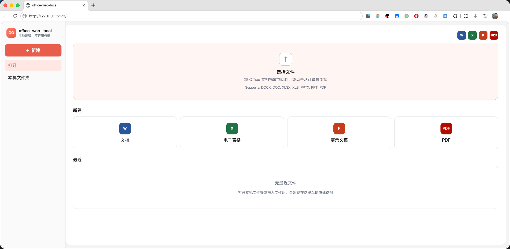
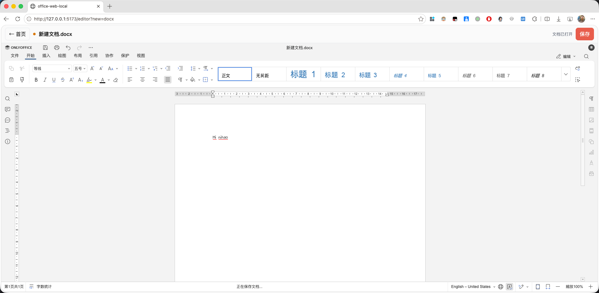
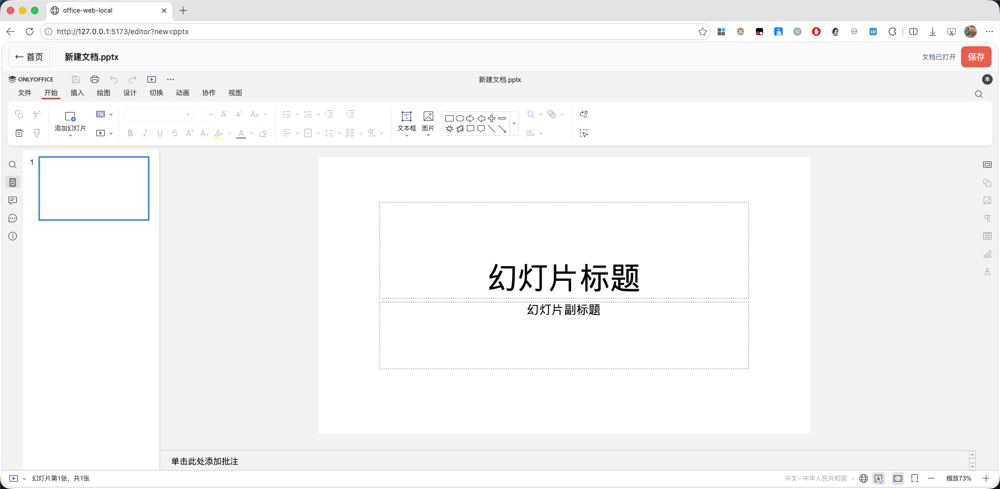
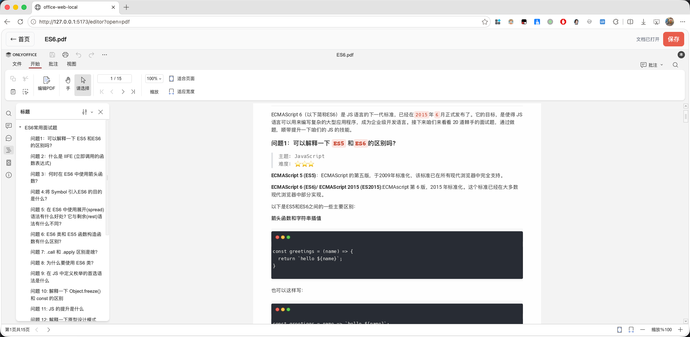
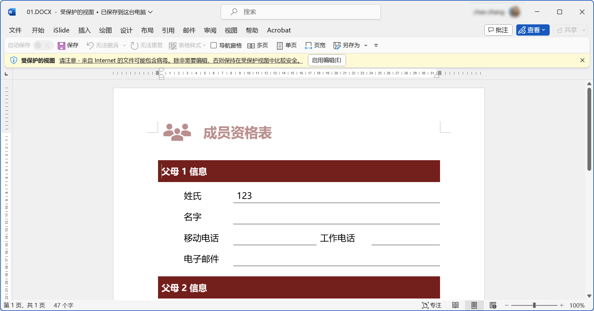

# office-web-local

A purely local project based on OnlyOffice, supporting local `opening and editing` of Office documents.

[Live Demo🪄](https://sweetwisdom.github.io/onlyoffice-web-local/)

A local web-based document editor based on OnlyOffice, allowing you to edit documents directly in your browser without server-side processing, ensuring your privacy and security.

[English](README.md) | [中文](readme.zh.md) | [Changelog](CHANGELOG.md)


## ✨ Key Features

- 🔒 **Privacy-First**: All document processing happens locally in your browser, with no uploads to any server
- 📝 **Multi-Format Support**: Supports DOCX, XLSX, PPTX, and many other document formats
- ⚡ **Real-Time Editing**: Provides smooth real-time document editing experience
- 🚀 **No Server Required**: Pure frontend implementation with no server-side processing needed
- 🎯 **Ready to Use**: Start editing documents immediately by opening the webpage

## 🛠️ Technical Architecture

This project is built on the following core technologies:

- **OnlyOffice SDK**: Provides powerful document editing capabilities
- **WebAssembly**: Implements document format conversion through x2t-wasm
- **Pure Frontend Architecture**: All functionality runs in the browser

## 📄 Opening Remote Files

### Functionality

Automatically downloads and opens remote Office files (e.g., `.docx`, `.pptx`) via route parameters, converting them into `File` objects for further use (e.g., preview or editing).

### Usage

The page URL must include the following parameters:

- `url` (required): Remote file address
- `filename` (optional): File name; if not provided, it will attempt to auto-resolve

Example:
[00.xlsx](https://sweetwisdom.github.io/onlyoffice-web-local/#/?url=https://sweetwisdom.github.io/react-filePreview/filePreview/00.xlsx)

```
?filename=00.pptx&url=https://example.com/files/00.pptx
```

### File Name Retrieval Priority

1. Route parameter `filename`
2. Parsed from `url`
3. Extracted from response header `Content-Disposition`

If the file name cannot be retrieved, the operation will terminate with an error prompt.



## 📚 Format Support & Features

| Feature | Supported formats | Preview |
| --- | --- | --- |
| Word editing | DOCX |  |
| Spreadsheet editing | XLSX |  |
| Presentation editing | PPTX |  |
| PDF viewing | PDF |  |
| Document export | DOCX, XLSX, PPTX, PDF |  |

## Development Setup

```sh
pnpm install
```

### Compile and Hot-Reload for Development

```sh
pnpm dev
```

### Type-Check, Compile, and Minify for Production

```sh
pnpm build
```

## Docker Support

Build a custom image named `vue-local-office` (note: the `.` at the end of the command indicates using the Dockerfile in the current directory; adjust the path as needed):

```sh
docker build -t vue-local-office .
```

Map ports and start the Docker container (8080:80 maps the container's port 80 to the host's port 8080; `local-office` is the custom container name; `vue-local-office` is the custom image name):

```sh
docker run -dp 8080:80 --name local-office vue-local-office
```

After executing the above commands, open http://localhost:8080 in a browser to preview.

## GitHub Actions (Release / Pages)

Workflows live in `.github/workflows/` (ported from onlyoffice-web-local, using npm):

| Workflow | Trigger | What it does |
|----------|---------|--------------|
| `release.yml` | Push `v*` tag, or manual `workflow_dispatch` | `npm run build` → upload `html.zip` to a Release |
| `deploy.yml` | Push to `main` | Deploy GitHub Pages + upload `html.zip` |

**Note:** Full offline assets live in `public/vendor` (~700MB) and are tracked directly in Git, so clones and initial deployments are large. Each Release asset must stay under ~2 GiB.

## Technical Details

- Uses `x2t-wasm` as a replacement for OnlyOffice services
- Utilizes OnlyOffice WebSDK for editing (sourced from `se-office`)

## References

- [Qihoo360/se-office: A full-featured office productivity suite based on open standards, enabling browser-based preview and editing of Office files.](https://github.com/Qihoo360/se-office)
- [cryptpad/onlyoffice-x2t-wasm: CryptPad WebAssembly file conversion tool](https://github.com/cryptpad/onlyoffice-x2t-wasm)
